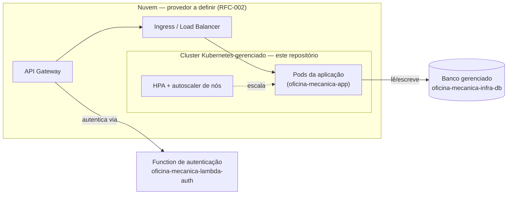

# oficina-mecanica-infra-k8s

Terraform do cluster Kubernetes gerenciado do **Sistema de Oficina Mecânica** — Tech Challenge da
pós-graduação em Arquitetura de Software (FIAP/SOAT), Fase 3.

> **Estado atual: esqueleto.** Este repositório ainda não provisiona nenhum recurso de nuvem. A
> escolha do provedor (AWS/GCP/Azure) é uma RFC pendente (RFC-002, no repositório
> [`oficina-mecanica-app`](https://github.com/gabrielMauad/oficina-mecanica-app)). Até essa decisão,
> não há região, ARN, tipo de instância ou credencial reais para declarar aqui — o que existe é a
> estrutura, o `.gitignore` e a pipeline de validação, prontos para receber o Terraform de verdade
> por Pull Request.

---

## Índice

- [Propósito](#propósito)
- [Tecnologias utilizadas](#tecnologias-utilizadas)
- [Diagrama do componente](#diagrama-do-componente)
- [Pré-requisitos](#pré-requisitos)
- [Instruções de execução](#instruções-de-execução)
- [Passos de deploy](#passos-de-deploy)
- [Explicação da pipeline](#explicação-da-pipeline)
- [Decisões e pontos em aberto](#decisões-e-pontos-em-aberto)

---

## Propósito

Provisionar, via Terraform, o cluster Kubernetes **gerenciado** (ex.: Amazon EKS) que executa a
aplicação principal (`oficina-mecanica-app`) na nuvem: rede (VPC/subnets), node group(s) com
escalabilidade, add-ons de cluster (metrics-server, autoscaler de nós) e a camada de entrada
(Ingress/Load Balancer) que o API Gateway usa para alcançar a aplicação.

## Tecnologias utilizadas

| Tecnologia | Uso |
|---|---|
| **Terraform** ≥ 1.5 | IaC de todo o cluster e da rede que o cerca |
| **GitHub Actions** | CI de validação (`fmt` + `validate`) em Pull Request |
| Provedor de nuvem | **A decidir** (RFC-002) — candidato natural: AWS (Amazon EKS), por ser o que o restante da análise da Fase 3 assume |

## Diagrama do componente



## Pré-requisitos

- [Terraform](https://developer.hashicorp.com/terraform/downloads) ≥ 1.5
- Hoje **não há mais nada a instalar**: sem provider declarado, não há credencial de nuvem para
  configurar. Isso muda assim que a RFC-002 for decidida — este README será atualizado com as
  credenciais/variáveis de ambiente necessárias (via secrets do GitHub, nunca commitadas).

## Instruções de execução

O único fluxo que faz sentido hoje é a validação estática, a mesma que a pipeline roda em cada PR:

```bash
terraform init -backend=false
terraform fmt -check -recursive
terraform validate
```

Não existe `terraform plan`/`apply` possível ainda: não há provider nem recursos declarados (ver
[Decisões e pontos em aberto](#decisões-e-pontos-em-aberto)). Descrever um passo a passo de plan/apply
aqui seria documentar um comando que não funciona — por isso não há um.

## Passos de deploy

Pendente da decisão de nuvem (RFC-002). Quando definida, o fluxo será:

1. PR com o Terraform real (provider, backend remoto, recursos do cluster).
2. CI roda `terraform fmt -check` + `terraform validate` — status check obrigatório da `main`.
3. Merge em `main`.
4. `terraform apply` automático (hoje comentado no workflow) contra o backend remoto de state,
   usando credenciais/role OIDC configuradas como secret deste repositório.

## Explicação da pipeline

Workflow em [`.github/workflows/ci.yml`](.github/workflows/ci.yml), GitHub Actions:

- **Em Pull Request** (job `validate`): `terraform fmt -check -recursive`, `terraform init
  -backend=false` e `terraform validate`. É o **status check obrigatório** da branch `main` — sem
  ele passar, o PR não pode ser mergeado.
- **Apply**: job `apply` **comentado** no workflow. Depende de três coisas que ainda não existem:
  a decisão de nuvem (RFC-002), o backend remoto do state (bucket S3 + DynamoDB, ou equivalente do
  provedor escolhido) e credenciais/role OIDC como secret deste repositório. O TODO no arquivo
  documenta exatamente essa dependência — não é um esquecimento.

## Decisões e pontos em aberto

- **Sem Dockerfile.** A orientação oficial da fase é incluir `Dockerfile` só onde for tecnicamente
  necessário; um repositório composto apenas de Terraform não roda nada em contêiner. Decisão, não
  esquecimento.
- **Sem provider/recurso ainda.** Depende da decisão de nuvem (RFC-002). Não foi inventado nenhum
  recurso, região, ARN ou credencial para preencher este repositório antes da hora.
- **Migração do Terraform local (kind) — adiada de propósito.** Hoje o cluster de desenvolvimento
  (**kind**, local/efêmero) é provisionado pelo Terraform em `infra/`, dentro do repositório
  [`oficina-mecanica-app`](https://github.com/gabrielMauad/oficina-mecanica-app), e continua lá por
  enquanto: o job de deploy do `ci-cd.yml` daquele repositório roda com
  `working-directory: infra`, e `infra/main.tf` aplica os manifestos de `../k8s` — mover a pasta
  agora quebraria a pipeline de deploy da aplicação sem ganho nenhum, já que o Terraform de nuvem
  ainda não existe para substituí-la.
  A migração acontece **no mesmo Pull Request que introduzir o Terraform de nuvem neste
  repositório** — não antes, e não em dois passos separados.
- **Ambiente de homologação**: em aberto (ver ADR-005 do repositório da aplicação) — depende do
  crédito disponível na conta de nuvem usada no projeto.

