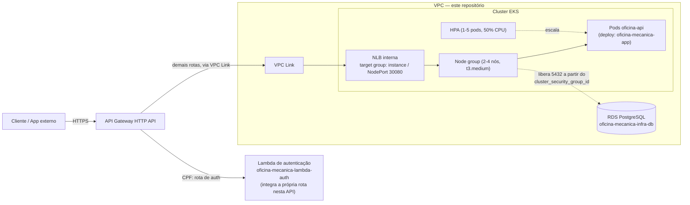

# oficina-mecanica-infra-k8s

Terraform do cluster Kubernetes gerenciado do **Sistema de Oficina Mecânica** — Tech Challenge da
pós-graduação em Arquitetura de Software (FIAP/SOAT), Fase 3.

Provisiona, na conta **AWS Academy Learner Lab**, a VPC, o cluster **Amazon EKS**, a exposição da
aplicação e o **API Gateway** — a nuvem escolhida e as restrições da conta estão documentadas em
[RFC-002](https://github.com/gabrielMauad/oficina-mecanica-app/blob/main/docs/arquitetura/rfcs/002-escolha-do-provedor-de-nuvem.md)
e [ADR-006](https://github.com/gabrielMauad/oficina-mecanica-app/blob/main/docs/arquitetura/adrs/006-credenciais-de-nuvem-no-cicd.md),
no repositório [`oficina-mecanica-app`](https://github.com/gabrielMauad/oficina-mecanica-app).

---

## Índice

- [Propósito](#propósito)
- [Tecnologias utilizadas](#tecnologias-utilizadas)
- [Diagrama do componente](#diagrama-do-componente)
- [Pré-requisitos](#pré-requisitos)
- [Instruções de execução](#instruções-de-execução)
- [Passos de deploy](#passos-de-deploy)
- [Explicação da pipeline](#explicação-da-pipeline)
- [Contrato de outputs](#contrato-de-outputs)
- [Decisões de desenho](#decisões-de-desenho)
- [O que não foi validado sem apply](#o-que-não-foi-validado-sem-apply)

---

## Propósito

Provisionar, via Terraform, tudo que fica entre a internet e a aplicação
(`oficina-mecanica-app`) rodando em contêiner:

- **Rede**: VPC com subnets públicas e privadas em 2 AZs, NAT Gateway, tags exigidas pelo EKS.
- **Cluster Kubernetes gerenciado**: Amazon EKS, com node group escalável (2 a 4 nós).
- **Exposição**: NLB interna + API Gateway (HTTP API) na frente do cluster.

O deploy da aplicação em si (imagem, ConfigMap/Secret, Deployment, HPA) continua sendo feito pela
pipeline do repositório `oficina-mecanica-app`, contra o cluster provisionado aqui — este
repositório não aplica manifestos Kubernetes.

## Tecnologias utilizadas

| Tecnologia | Uso |
|---|---|
| **Terraform** ≥ 1.5, provider `hashicorp/aws` ~> 5.0 | IaC de toda a infraestrutura de nuvem |
| **Amazon EKS** | Cluster Kubernetes gerenciado |
| **Amazon API Gateway (HTTP API)** | Porta de entrada única da aplicação |
| **AWS Network Load Balancer** | Expõe o NodePort da aplicação dentro da VPC ao API Gateway |
| **GitHub Actions** | CI de validação (PR) e apply (push/dispatch na `main`) |

## Diagrama do componente



## Pré-requisitos

- [Terraform](https://developer.hashicorp.com/terraform/downloads) ≥ 1.5
- Uma sessão ativa da **AWS Academy Learner Lab**, com as credenciais de sessão
  (`AWS_ACCESS_KEY_ID`, `AWS_SECRET_ACCESS_KEY`, `AWS_SESSION_TOKEN`) exportadas no ambiente para
  rodar `plan`/`apply` localmente
- Um **bucket S3** já existente, criado manualmente uma única vez — é pré-requisito do próprio
  backend, então não pode ser provisionado por este Terraform (RFC-002 §6.4). O mesmo bucket é
  compartilhado com `oficina-mecanica-infra-db`, sob uma chave diferente.

> **Sem lock de state.** Não há tabela DynamoDB para locking. Os dois repositórios de
> infraestrutura usam chaves distintas no mesmo bucket, então não há concorrência entre eles, e o
> `apply` é executado por uma única pessoa. Numa equipe ou com pipelines concorrentes, o lock seria
> obrigatório — aqui ele só acrescentaria custo e uma peça a manter numa conta de crédito finito.

## Instruções de execução

**Validação estática** (não exige credencial — é o que o CI roda em todo PR):

```bash
terraform init -backend=false
terraform fmt -check -recursive
terraform validate
```

**`init` com o backend real** (backend parcial: `backend.tf` declara `backend "s3" {}` vazio, sem
nome de bucket commitado — os valores entram aqui):

```bash
terraform init \
  -backend-config="bucket=<nome-do-bucket-s3>" \
  -backend-config="key=infra-k8s/terraform.tfstate" \
  -backend-config="region=us-east-1"
```

**`plan`/`apply`** exigem as credenciais de sessão da AWS Academy exportadas no ambiente
(`AWS_ACCESS_KEY_ID`, `AWS_SECRET_ACCESS_KEY`, `AWS_SESSION_TOKEN`):

```bash
terraform plan
terraform apply
```

## Passos de deploy

1. PR contra a `main` deste repositório com o Terraform. CI roda `fmt` + `validate` — status check
   obrigatório.
2. Merge em `main`.
3. Job `apply` do workflow (push na `main` ou `workflow_dispatch`) provisiona a infraestrutura
   contra o backend remoto de state.
4. Com o cluster no ar, a pipeline de `oficina-mecanica-app` faz o deploy da aplicação (imagem +
   manifestos `k8s/`) contra este cluster.
5. `oficina-mecanica-infra-db` e `oficina-mecanica-lambda-auth` consomem os outputs deste
   repositório via `terraform_remote_state` (ver [Contrato de outputs](#contrato-de-outputs)).

Como o ambiente é efêmero (RFC-002 §6.3), o ciclo esperado é provisionar, validar/gravar a
demonstração e destruir (`terraform destroy`) — não manter o cluster no ar indefinidamente.

## Explicação da pipeline

Workflow em [`.github/workflows/ci.yml`](.github/workflows/ci.yml):

- **`validate`** (Pull Request): `terraform fmt -check -recursive`, `terraform init -backend=false`
  e `terraform validate`. Status check obrigatório da `main`.
- **`apply`** (push/`workflow_dispatch` na `main`, depende de `validate`): autentica com
  `aws-actions/configure-aws-credentials`, usando as **credenciais de sessão temporárias** da conta
  AWS Academy — não OIDC/IAM role, que esta conta não permite criar (ADR-006). Requer três secrets
  do repositório, **incluindo obrigatoriamente** `AWS_SESSION_TOKEN`, e a variável do repositório
  `vars.TF_STATE_BUCKET` para o `-backend-config`. Roda
  sob o Environment `aws-academy` do GitHub — crie-o em Settings → Environments e associe os
  secrets a ele (ou aos secrets do repositório, visíveis a qualquer Environment).
- As credenciais de sessão expiram com a sessão do laboratório: se o `apply` falhar na
  autenticação, é preciso renovar os três secrets e reexecutar via `workflow_dispatch` — não é
  pipeline quebrada (ADR-006).

## Contrato de outputs

Consumido por `terraform_remote_state` pelos demais repositórios do projeto.
**`vpc_id`, `private_subnet_ids` e `cluster_security_group_id` são consumidos por
`oficina-mecanica-infra-db`, que está sendo implementado em paralelo — não renomeie sem avisar.**

| Output | Tipo | Consumido por | Uso |
|---|---|---|---|
| `vpc_id` | string | `infra-db` | VPC do DB subnet group do RDS |
| `private_subnet_ids` | list(string) | `infra-db` | Subnets do DB subnet group do RDS |
| `public_subnet_ids` | list(string) | — | Referência/depuração |
| `cluster_security_group_id` | string | `infra-db` | SG a partir do qual o RDS libera a porta 5432 |
| `cluster_name` | string | — | Nome do cluster EKS |
| `cluster_endpoint` | string | — | Endpoint da API do Kubernetes |
| `cluster_certificate_authority_data` | string | — | CA do cluster, para montar o kubeconfig |
| `app_load_balancer_arn` / `app_load_balancer_dns_name` | string | — | NLB interna que expõe o NodePort da aplicação |
| `api_gateway_id` | string | `lambda-auth` | Id da HTTP API, para criar a integração/rota de autenticação por CPF nesta mesma API |
| `api_gateway_execution_arn` | string | `lambda-auth` | Necessário para a Lambda aceitar invocações vindas deste API Gateway |
| `api_gateway_endpoint` | string | — | URL pública de invocação da API |

## Decisões de desenho

**`aws_eks_cluster`/`aws_eks_node_group` diretamente, não o módulo `terraform-aws-modules/eks`.**
O módulo é ótimo, mas cria IAM roles por padrão (para o cluster, os nós e, se usado, IRSA) — a
conta AWS Academy Learner Lab não permite criar IAM roles (RFC-002 §6.1). Seria possível desligar
essa criação e passar os ARNs das roles pré-criadas (`create_iam_role = false` +
`iam_role_arn = ...`), mas a superfície de variáveis do módulo dedicada a contornar um caso que
aqui é a regra (nenhum IAM role, em lugar nenhum) tornaria a configuração menos legível do que
declarar os dois recursos diretamente com `data "aws_iam_role"`. Optamos pelos recursos diretos.

**Exposição: NLB interna gerenciada pelo Terraform + API Gateway via VPC Link, não AWS Load
Balancer Controller + Ingress.** O AWS Load Balancer Controller normalmente exige um IAM role via
IRSA (o próprio controller precisa de permissões de EC2/ELB não cobertas pela role dos nós) — o que
esta conta não permite criar, então essa alternativa foi descartada antes mesmo de ser tentada, não
por preferência de estilo. A NLB é criada e gerenciada por este Terraform (não pelo Kubernetes):
o alvo é o Auto Scaling Group do node group (`aws_autoscaling_attachment`), no NodePort 30080 já
usado pelo Service da aplicação hoje. Isso evita a dependência circular de uma NLB criada
dinamicamente por um `Service type=LoadBalancer` (cujo ARN só existiria depois do primeiro deploy
da aplicação, numa pipeline diferente) e **não exige nenhuma mudança no repositório da
aplicação** — o Service continua `NodePort`. É o caminho mais simples que funciona.

**Add-ons via `aws_eks_addon`, não Helm.** `vpc-cni`, `kube-proxy`, `coredns` e `metrics-server` são
add-ons gerenciados pela AWS. Usá-los evita configurar os providers `kubernetes`/`helm` com
autenticação do cluster só para o metrics-server — que, além de mais uma peça, teria uma
dependência de ordem delicada (o provider precisa que o cluster já exista para autenticar, no mesmo
apply que o cria).

## O que não foi validado sem apply

Este repositório foi validado com `terraform init -backend=false`, `terraform fmt -check
-recursive` e `terraform validate` — nenhum deles fala com a conta AWS. `plan`/`apply` não foram
executados nesta sessão (sem credenciais). Fica para quem rodar o primeiro `apply`, com a sessão do
laboratório ativa, confirmar:

- **Se `LabEksClusterRole` realmente serve tanto para `aws_eks_cluster.role_arn` quanto para
  `aws_eks_node_group.node_role_arn`.** RFC-002 diz que sim ("roles pré-criadas `LabEksClusterRole`
  para cluster e nós"), mas a policy efetiva anexada à role só é visível na conta real.
- **Disponibilidade do add-on gerenciado `metrics-server`** (`aws_eks_addon`) para a versão do
  cluster nesta conta/região — é um add-on relativamente recente da AWS. Se `apply` falhar nele
  especificamente, o fallback é instalar via `helm_release` (como na Fase 2, `infra/main.tf` no
  repositório da aplicação), o que exige configurar os providers `kubernetes`/`helm` com a
  autenticação do cluster.
- **Se a versão do Kubernetes (`var.kubernetes_version`, hoje `1.31`) está disponível** na conta —
  contas Academy às vezes atrasam versões suportadas.
- **Se o `data "aws_availability_zones"` retorna pelo menos 2 AZs elegíveis** em `us-east-1` para
  esta conta (esperado, mas não confirmado sem acesso).
- **Health check da NLB em `/healthz`** só fica saudável depois que a aplicação estiver de fato
  implantada no cluster (pipeline de `oficina-mecanica-app`) — o `apply` deste repositório cria a
  infraestrutura independente disso, mas o alvo só respondera 200 depois do deploy da app.
- **Limite de 9 instâncias/32 vCPU da conta**: 2 nós `t3.medium` (4 vCPU) ficam bem dentro do
  limite; não testado contra o painel real da conta.
